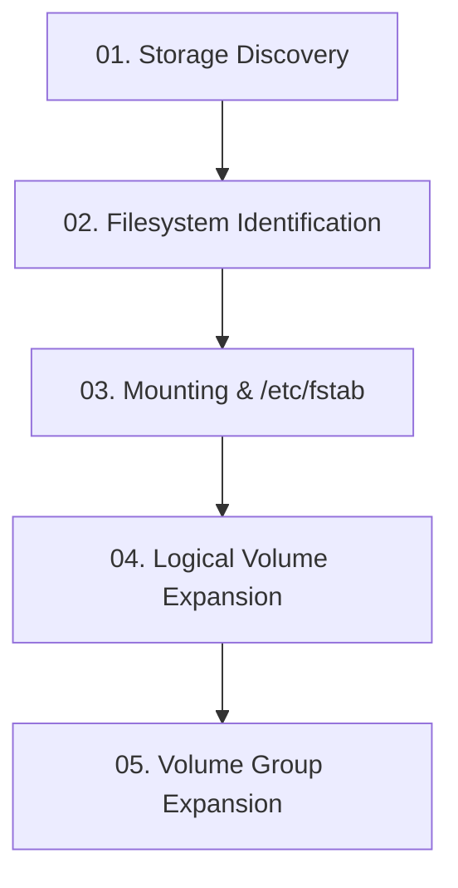

# Linux Storage Filesystems

```mermaid
flowchart TD

A["01. Storage Discovery"]

B["02. Filesystem Identification"]

C["03. Mounting & /etc/fstab"]

D["04. Logical Volume Expansion"]

E["05. Volume Group Expansion"]

A --> B

B --> C

C --> D

D --> E

```

