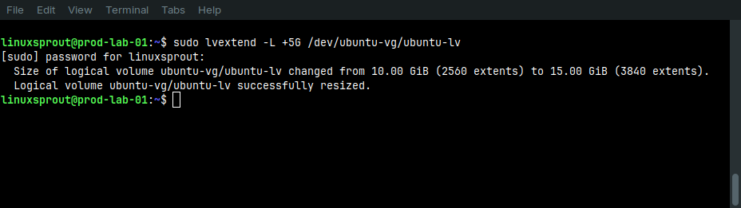
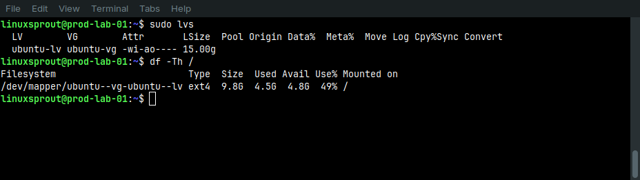

# Objective

Increase the capacity of the root Logical Volume from **10 GB** to **15 GB** by utilizing the free space available in the existing Volume Group without adding a new physical disk.

## Initial Storage State

| Component | Value |
|-----------|-------|
| Physical Volume | `/dev/sda3` |
| Volume Group | `ubuntu-vg` |
| Logical Volume | `ubuntu-lv` |
| Logical Volume Size | 10 GB |
| Filesystem | ext4 |
| Free Space in VG | 8.22 GB |

## Commands Used

### Step 1 – Identify the Logical Volume

```bash
sudo lvs -o lv_name,vg_name,lv_size,lv_path
```

Output:

```
LV         VG         LSize   Path
ubuntu-lv  ubuntu-vg  10.00g  /dev/ubuntu-vg/ubuntu-lv
```

**Purpose**

Identify the Logical Volume to be expanded and verify its device path before making any changes.

### Step 2 – Extend the Logical Volume

```bash
sudo lvextend -L +5G /dev/ubuntu-vg/ubuntu-lv
```

**Result**



The Logical Volume increased from **10 GB** to **15 GB**.

### Step 3– Verify the Logical Volume

```bash
sudo lvs
```



The Logical Volume size was successfully updated to **15 GB**.

### Step 4 – Verify the Filesystem

```bash
df -Th /
```

The filesystem size remained approximately **10 GB**, confirming that extending the Logical Volume alone does not automatically resize the filesystem.

### Step 5 – Expand the `ext4` Filesystem

```bash
sudo resize2fs /dev/ubuntu-vg/ubuntu-lv
```

The ext4 filesystem was successfully expanded while remaining mounted.

### Step 6 – Final Verification

```bash
df -Th /
lsblk -f
```

Both commands confirmed that the root filesystem now utilizes the full **15 GB** Logical Volume.

# Findings

- The Logical Volume was successfully extended from **10 GB** to **15 GB**.
- Immediately after running `lvextend`, the ext4 filesystem still reported approximately **10 GB**, demonstrating that extending a Logical Volume does not automatically resize the filesystem.
- The `resize2fs` command successfully expanded the ext4 filesystem while it remained mounted.
- No reboot or downtime was required because ext4 supports online filesystem expansion.
- Final verification confirmed that the root filesystem now has a total size of approximately **15 GB**.


# Conclusion

The Logical Volume and its ext4 root filesystem were successfully expanded from 10 GB to 15 GB using the free space available in the existing Volume Group. The operation was completed online without requiring a reboot or service interruption, demonstrating a common LVM storage expansion workflow in Linux administration.
