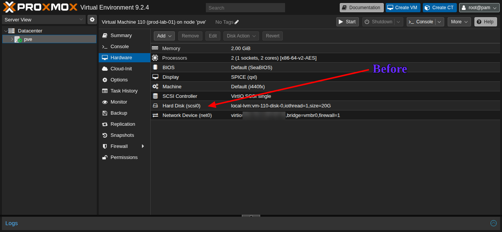
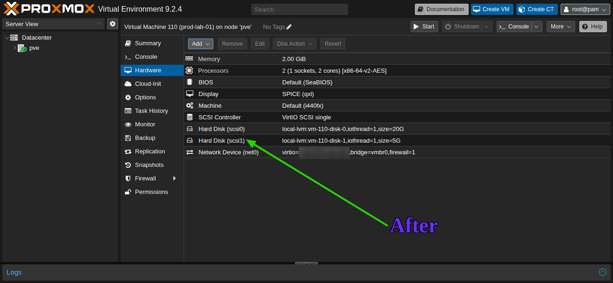
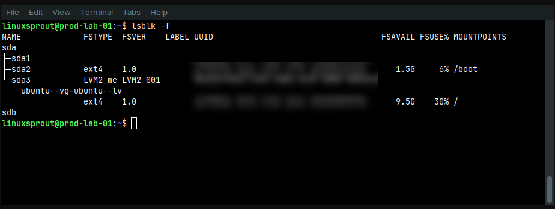
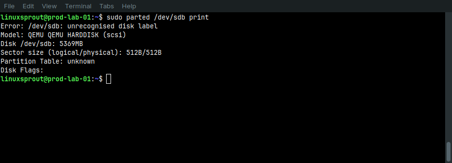
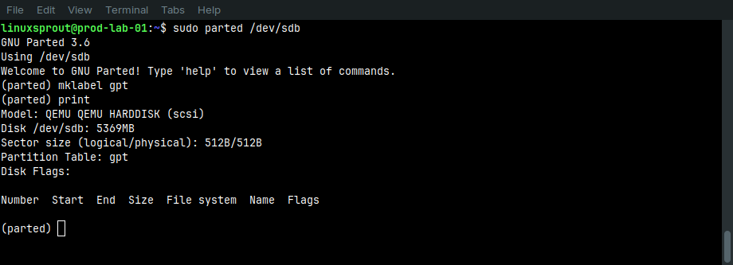
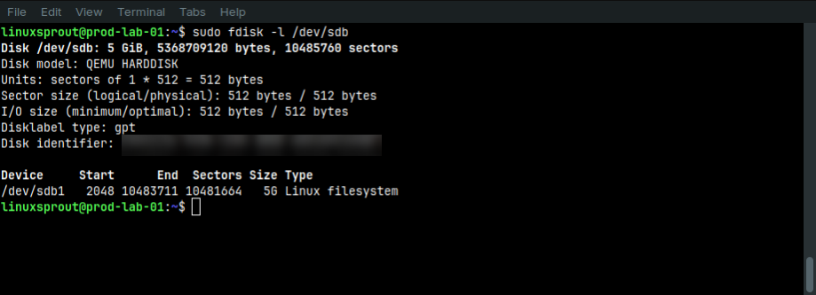
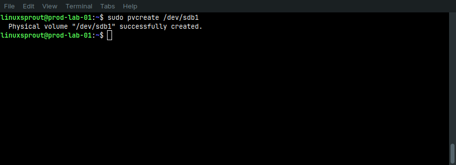
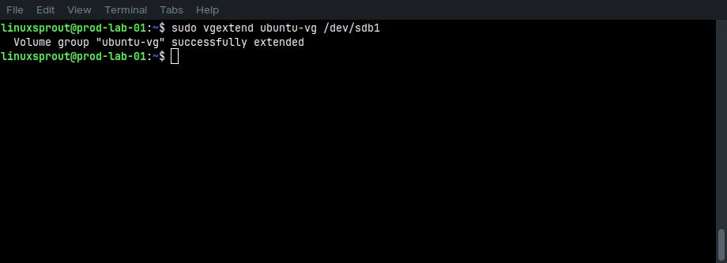
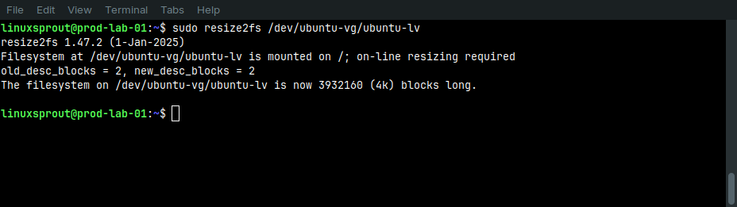

# Objective

Expand the existing LVM storage by adding a new virtual disk, creating a new Physical Volume, extending the existing Volume Group, extending the Logical Volume, and finally growing the ext4 filesystem.

## Initial Storage State

```
Disk: /dev/sda (20 GB)

sda
├── sda1
├── sda2 (/boot)
└── sda3
      │
      ▼
Physical Volume
      │
      ▼
Volume Group (ubuntu-vg)
      │
      ▼
Logical Volume (ubuntu-lv)
      │
      ▼
ext4 Filesystem (/)
```


**LVM Status (Start of Lab):**

The existing Volume Group had already been expanded in the [previous lab](04-lvm-storage-expansion.md) by utilizing its available free space.

|Component|Value|
|---|---|
|Physical Volumes|1|
|Volume Group Size|18.22 GiB|
|Logical Volume Size|15.00 GiB|
|Free Space in VG|3.22 GiB|

Added a second **5 GB** virtual disk and extended the existing LVM storage to make the additional capacity available to the root filesystem.

This simulates a common production scenario where a running Linux server requires additional storage without reinstalling the operating system.

## Commands Used

### Step 1 – Add a New Virtual Disk

A new **5 GB** virtual disk was attached to the virtual machine through Proxmox.

**Before:**



**After:**



### Step 2 – Inspect the Storage


```bash
lsblk -f
sudo fdisk -l
sudo pvs
sudo vgs
sudo lvs
```

Verification:


- New disk detected as `/dev/sdb`

  

- No partition table
- No partitions
- No filesystem
- Not part of LVM
### Step 3 – Verify the Disk State


```bash
sudo parted /dev/sdb print
```

**Result**:



This confirmed that the disk had never been initialized and was safe to prepare.

### Step 4 – Create a GPT Partition Table


```bash
sudo parted /dev/sdb
```

```
mklabel gpt
print
quit
```



Verification confirmed that the disk now contained a GPT partition table.

### Step 5 – Create a Partition


```bash
sudo parted /dev/sdb
```

```
mkpart primary 1MiB 100%
print
quit
```

Verification:

```bash
lsblk -f
sudo fdisk -l /dev/sdb
```

**Result**:

- Partition `/dev/sdb1` created

  

- Entire disk allocated
- No filesystem present

### Step 6 – Create a Physical Volume


```bash
sudo pvcreate /dev/sdb1
```

Verification:

```bash
sudo pvs
sudo pvdisplay /dev/sdb1
```

**Result**:

- `/dev/sdb1` became a new LVM Physical Volume.

  

- It was not yet assigned to any Volume Group.

### Step 7 – Extend the Volume Group

### Discover the Target Volume Group

```bash
findmnt /
sudo lvs -o lv_name,vg_name,lv_path
sudo vgs
sudo vgdisplay ubuntu-vg
```

These commands confirmed that the root Logical Volume belonged to the `ubuntu-vg` Volume Group.

### Extend the Volume Group


```bash
sudo vgextend ubuntu-vg /dev/sdb1
```



Verification:

```bash
sudo pvs
sudo vgs
sudo vgdisplay ubuntu-vg
```

**Result**:

- Physical Volumes increased from **1** to **2**.
- Volume Group size increased from **18.22 GiB** to approximately **23.22 GiB**.
- Available free space increased from **3.22 GiB** to approximately **8.22 GiB**.

### Step 8 – Discover the Logical Volume


```bash
sudo lvs -o lv_name,vg_name,lv_size,lv_path
```

**Result**:

- Logical Volume: `ubuntu-lv`
- Volume Group: `ubuntu-vg`
- Device Path: `/dev/ubuntu-vg/ubuntu-lv`

### Step 9 – Extend the Logical Volume


```bash
sudo lvextend -L +5G /dev/ubuntu-vg/ubuntu-lv
```

Verification:

```bash
sudo lvs
df -Th /
```

**Result**:

- Logical Volume increased from **15 GB** to **20 GB**.
- The filesystem still reported **15 GB**, confirming that the filesystem had not yet been resized.

### Step 10 – Expand the ext4 Filesystem


```bash
sudo resize2fs /dev/ubuntu-vg/ubuntu-lv
```



## Step 11 – Final Verification


```bash
df -Th /

lsblk -f
sudo pvs
sudo vgs
sudo lvs
```

### Final Storage State

|Component|Value|
|---|---|
|Physical Volumes|2|
|Volume Group Size|~23.22 GiB|
|Logical Volume Size|20.00 GiB|
|Remaining Free Space|~3.22 GiB|


# Findings

- A GPT partition table does not create partitions.
- A partition does not contain a filesystem until one is created.
- An LVM Physical Volume is not usable until it belongs to a Volume Group.
- A Volume Group combines storage from one or more Physical Volumes into a single storage pool.
- Extending a Logical Volume does not automatically resize the filesystem.
- The filesystem must be expanded separately to make newly allocated space available.
- Storage expansion in LVM occurs in layers: Physical Volume → Volume Group → Logical Volume → Filesystem.

# Conclusion

This lab demonstrated a complete end-to-end LVM storage expansion workflow. A new virtual disk was initialized with GPT, partitioned, converted into an LVM Physical Volume, added to an existing Volume Group, used to extend the root Logical Volume, and finally made available to the operating system by expanding the ext4 filesystem. The exercise reinforces the layered architecture of Linux storage management and the importance of verifying each stage before proceeding to the next.