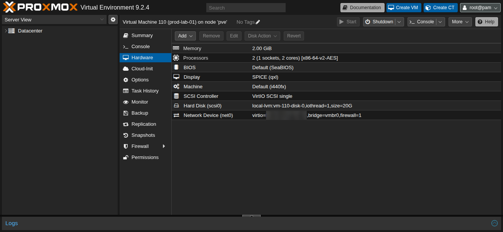

# Architecture

## Environment

Host Hypervisor:
- Proxmox VE 

Virtual Machine:
- Ubuntu Server 25.04 (Plucky Puffin)

Network:
- VM connected through Proxmox virtual bridge
- Ubuntu interface: `<primary-network-interface>` 

Purpose:

- Linux Administration Lab
- Security Hardening
- Automation
- Monitoring
- Troubleshooting Practice

Future Enhancements

- Docker
- Monitoring
- Backup
